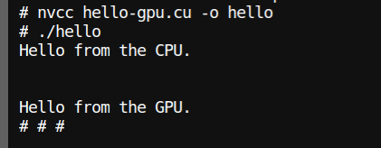
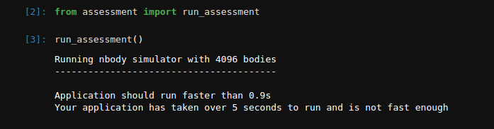
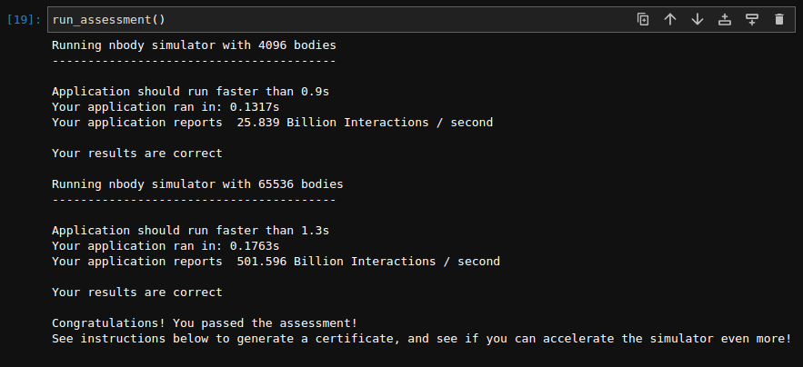
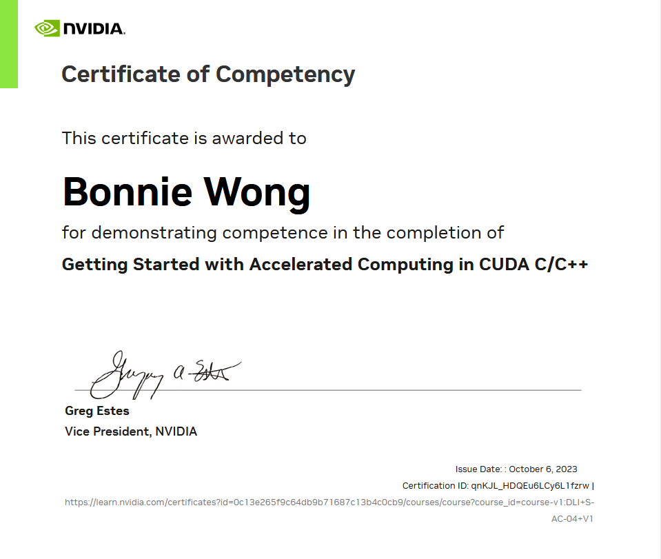

# Nvidia

## Getting Started with Accelerated Computing in CUDA C/C++

Exercise screenshot

### Hello World

### Fail attempt

### Succeed

## Certificate

Course Link:

1. https://learn.nvidia.com/courses/course-detail?course_id=course-v1:DLI+S-AC-04+V1

Useful Link

1. https://developer.nvidia.com/nsight-systems/get-started#latest-win-linux/?ncid=ref-dev-171762-42
2. https://developer.nvidia.com/tools-overview/nsight-compute/get-started/
